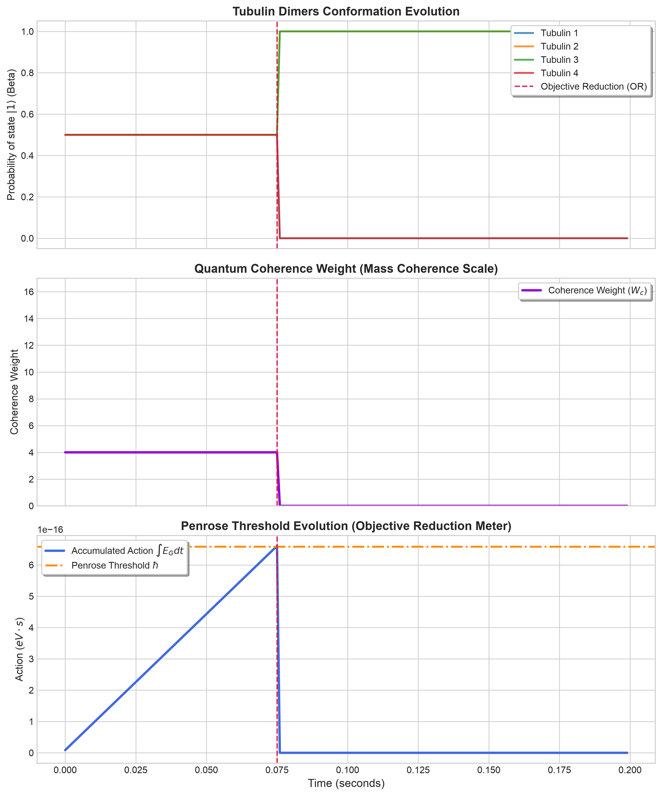

# Resolving Classical Dilemmas with Quantum Mechanics

This repository contains two Qiskit-based simulations that explore how **quantum mechanics resolves fundamental classical dilemmas**—both in social decision-making (game theory) and physical/cognitive biology (wave-function collapse).

Whether it is the social trap of the **Prisoner's Dilemma** or the physical tension of a **spacetime-split superposition**, classical rules often lead to sub-optimal traps or infinite uncertainty. Quantum mechanics provides the mathematical resolution.

---

## 1. The Social Dilemma: Quantum Prisoner's Dilemma (`quantum_game.py`)

In classical economics, the **Prisoner's Dilemma** is the ultimate trap: two rational agents pursuing self-interest are mathematically forced to **defect**, leading to a sub-optimal payoff of **(1, 1)** instead of cooperating for **(3, 3)**.

### The Quantum Resolution
By implementing the **Eisert-Wilkens-Lewenstein (EWL)** model, we entangle the decision space of the two players. This introduces a purely quantum strategy ($Q$) that neutralizes classical defection:
* **Anti-Exploitation:** If a player attempts to classically defect ($D$) against a quantum cooperator ($Q$), the entanglement collapses the state against them: the quantum player gets **5 points** (maximum), and the defector gets **0 points**.
* **A New Equilibrium:** Because defection is heavily penalized, **$(Q, Q)$ becomes the only stable Nash Equilibrium**, forcing rational agents to cooperate and receive **(3, 3)**.

### Simulation Results

To run the game theory simulation:
```bash
python3 quantum_game.py
```

| Scenario | Player 1 Strategy | Player 2 Strategy | Payoff (P1, P2) | State Resolution |
| :--- | :---: | :---: | :---: | :---: |
| **Classical Cooperation** | Cooperate ($C$) | Cooperate ($C$) | (3.00, 3.00) | 100% $|CC\rangle$ |
| **Classical Defection** | Defect ($D$) | Defect ($D$) | **(1.00, 1.00)** | 100% $|DD\rangle$ (Old Nash Eq.) |
| **Classical Exploitation** | Defect ($D$) | Cooperate ($C$) | (5.00, 0.00) | 100% $|DC\rangle$ |
| **Quantum Exploiting Defector**| Quantum ($Q$) | Defect ($D$) | (5.00, 0.00) | 100% $|DC\rangle$ |
| **Quantum Mutual Cooperation** | Quantum ($Q$) | Quantum ($Q$) | **(3.00, 3.00)** | 100% $|CC\rangle$ (New Nash Eq.) |

---

## 2. The Physical/Cognitive Dilemma: Orch-OR Simulation

In the **Orchestrated Objective Reduction (Orch-OR)** model of consciousness proposed by Roger Penrose and Stuart Hameroff, the brain's microtubules experience a physical dilemma:
* **The Dilemma:** Tubulin proteins exist in a quantum superposition of conformations $|0\rangle$ (Alpha) and $|1\rangle$ (Beta). This superposition represents a physical "split" in spacetime geometry.
* **The Resolution:** Spacetime cannot tolerate this split indefinitely. The system accumulates gravitational self-energy ($E_G$) over time. Once the action threshold is reached ($\int E_G dt \ge \hbar$), the spacetime dilemma is resolved through **spontaneous collapse (Objective Reduction)** to a definite classical state, producing a moment of proto-consciousness.

### How the Simulation Works
1. **`physics.py`:** Calculates $E_G$ using Penrose's mass displacement formula and scales it by the state's quantum coherence (purity).
2. **`circuit.py`:** Evolve the qubits under a Trotterized transverse-field Ising Hamiltonian.
3. **`simulation.py`:** Integrates the action step-by-step and triggers a projective collapse (resetting the action) when the threshold is crossed.

---

## 🚀 Getting Started

### 1. Installation
Set up the virtual environment and install Qiskit:
```bash
bash setup_env.sh
source venv/bin/activate
```

### 2. Running the Orch-OR Simulation
To run the simulation and plot the build-up of cognitive action and its spontaneous collapse (using a scaling factor of `1e17` to trigger collapse in a 4-qubit toy model):
```bash
python3 main.py --qubits 4 --steps 200 --scale-eg 1e17 --output simulation_results.png
```

---

## 📊 Output Visualization Explained



* **Top Panel (Conformation):** Shows the qubits oscillating in superposition until the red dashed line (OR collapse), where they are forced to resolve into a classical conformation (e.g., $|1011\rangle$).
* **Middle Panel (Coherence):** Tracks quantum entanglement. Falls instantly to base levels upon collapse.
* **Bottom Panel (Action):** Shows the gravitational action rising until it hits the orange dashed line ($\hbar$), resolving the spacetime dilemma.

---

## 💡 Conclusion: The Metaphysical Takeaway

Both simulations in this repository demonstrate a unified theme: **classical frameworks trap systems in sub-optimal or indeterminate states.** 
* In game theory, classical logic traps self-interested players in mutual defection. Quantum entanglement resolves this by aligning their states toward cooperation.
* In physics, a classical world cannot explain how quantum possibilities crystallize into definite facts. Spontaneous gravity-induced collapse (OR) resolves this by continually translating superposition (potentiality) into classical geometry (actuality).
